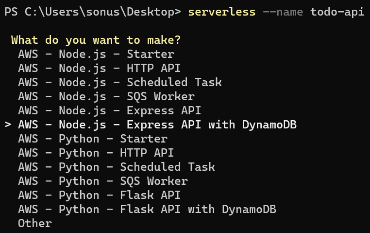
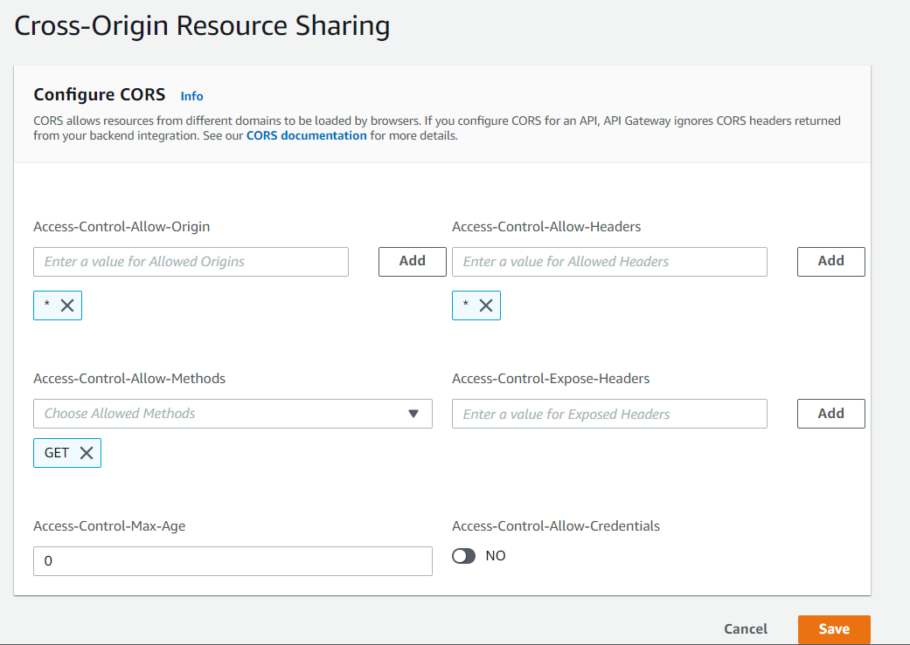

# Building microservice using ExpressJS, AWS Lambda and DynamoDB with Serverless framework 
Serverless framework is a command line tool that can be used to build and deploy AWS serverless microservices using AWS Lambda. It offers various project templates to start with. You can configure the `serverless.yml` file to configure the AWS resources you want to provision during deployment of microservice.

## Prerequisites 
    * NodeJS 14.x
    * Visual Studio Code
    * Serverless Framework CLI
    * AWS account

This tutorial will help you to create a serverless microservice for managing the Todo actions using expressjs and DynamoDb.

## Install and configure the Serverless Framework
1) Run the following command to install the latest version of `serverless` Command line tool.
    ```bash
    npm install -g serverless
    ```

2) After the CLI has been successfully installed, run the following command to create a new project that uses Expressjs and DynamoDB for creating serverless Lambda project.
    ```bash
    serverless --name todo-api
    ```

    

3) For the `What org do you want to add this service to?` option choose and organization name or select `[Skip]`.

4) For the `Do you want to deploy your project? (Y/n)` option enter `n` to specify `No`.

5) Switch to the project directory using the following command.
    ```bash
    cd todo-api
    ```

6) You need to update the `serverless.yml` to specify the AWS resources such as Lambda and DynamoDB. Update the `custom` section with the following code to specify the DynamoDb table name as `Todos`.
    ```yml
    custom:
      tableName: 'Todos'    
    ```
7) Update the `functions` section to change the Lambda api name as `todo-api`.
    ```yml
    functions:
      todo-api:
        handler: handler.handler
        events:
          - httpApi: '*'
    ```

8) Also update the configuration for DynamoDb by updating the `resources` section. It will create a DynamoDb resource with the table name specified in the above custom section. The table will have a partition key `Email` and a Sort key `Id`.

    ```yml
    resources:
      Resources:
        TodoTable:
          Type: AWS::DynamoDB::Table
          Properties:
            AttributeDefinitions:
              - AttributeName: Email
                AttributeType: S
              - AttributeName: Id
                AttributeType: S
            KeySchema:
              - AttributeName: Email
                KeyType: HASH
              - AttributeName: Id
                KeyType: RANGE
            BillingMode: PAY_PER_REQUEST
            TableName: ${self:custom.tableName}
    ```

9) In the project you need to install some npm dependencies such as `@aws-sk/client-dynamodb`, `@aws-sdk/util-dynamodb`, and `uuid`.
    ```bash
    npm install -S @aws-sk/client-dynamodb @aws-sdk/util-dynamodb uuid
    ```

10) Create a new folder in the project and name it as `helpers`. Add a new file called `ddbclient.js` to it and add the following code to it.
    ```javascript
    const { DynamoDBClient } = require("@aws-sdk/client-dynamodb");

    const ddbClient = new DynamoDBClient({ region: 'us-east-1'  });
    
    module.exports =  { ddbClient };
    ```

11) Also add another javascript file called `todo-helper.js` in the `helpers` folder and add the following CRUD operations code to it.
    ```javascript
    
    const { ddbClient } = require('./ddbclient');
    const { QueryCommand,
        PutItemCommand,
        GetItemCommand,
        ScanCommand } = require('@aws-sdk/client-dynamodb');
    const { marshall, unmarshall } = require('@aws-sdk/util-dynamodb');
    
    class TodoService {
    
        constructor(tableName) {
            this.TABLENAME = tableName
        }
    
        // addTodo(todo) {
        //     let params = {
        //         TableName: this.TABLENAME,
        //         Item: {
        //             Email: { 'S': todo.Email }, //PK
        //             Id: { 'S': todo.Id },  //SK
        //             Title: { 'S': todo.Title},
        //             IsCompleted: { 'BOOL': todo.IsCompleted }
        //         }
        //     }
        //     return ddbClient.send(new PutItemCommand(params))
        // }
    
        addTodo(todo) {
            let params = {
                TableName: this.TABLENAME,
                Item: marshall(todo)
            }
            return ddbClient.send(new PutItemCommand(params))
    
        }
    
        async getTodosByEmail(email) {
            var params = {
                TableName: this.TABLENAME,
                KeyConditionExpression: "Email = :email",
                ExpressionAttributeValues: {
                    ":email": { 'S': email }
                }
            };
            let result = await ddbClient.send(new QueryCommand(params))
                .catch(err => Promise.reject(err));
            let todos= [];
            result.Items.forEach((item)=> todos.push(unmarshall(item)));
            return Promise.resolve(todos)
        }
    
        async getTodo(email, id) {
            var params = {
                TableName: this.TABLENAME,
                Key: marshall({
                    Email: email,
                    Id: id
                })
            };
            let result = await ddbClient.send(new GetItemCommand(params))
                .catch(err => Promise.reject(err));
            return Promise.resolve(unmarshall(result.Item))
        }
    
        async getAll() {
            let params = {
                TableName: this.TABLENAME,
            }
            let result = await ddbClient.send(new ScanCommand(params))
                .catch(err => Promise.reject(err));
            let todos = [];
            result.Items.forEach((item) => todos.push(unmarshall(item)));
            return Promise.resolve(todos)
        }
    }
    
    module.exports = { TodoService }
    ```

12) Create another folder in the project root folder named `routes`. Define the express routes configurations inside this folder. Create a new javascript file named `todo-routes.js` in the `routes` folder and add the following code to it.
    ```javascript    
    const { Router } = require('express');
    const uuid = require('uuid');
    const { TodoService } = require("../helpers/todo-helper");
    
    var router = Router();
    const todoSvc = new TodoService(process.env.TODO_TABLE);
    
    
    //Add a todo item
    //POST /todos
    router.post("/", async function (req, res) {
        const todo = req.body;
        todo.Id = uuid.v4();
    
        if (typeof todo.Email !== "string") {
            res.status(400).json({ error: '"Email" must be a string' });
        } else if (typeof todo.Title !== "string") {
            res.status(400).json({ error: '"Title" must be a string' });
        } else if (typeof todo.IsCompleted != "boolean")
            res.status(400).json({ error: '"IsCompleted" must be a boolean' })
    
        let result = await todoSvc.addTodo(todo)
            .catch(err => {
                console.log('Error received in catch:', err);
                res.status(500).json(`Error:Unable to insert todo item`);
            });
        if (result) {
            res.status(201).json(`Todo item created with id '${todo.Id}'`)
        }
    });
    
    //Get a single todo item
    //GET /todos/user/:email/id:/:id
    router.get("/user/:email/id/:id", async function (req, res) {
    
        let result = await todoSvc.getTodo(req.params.email, req.params.id)
            .catch(err => {
                console.log(err);
                res.status(500).json({ error: 'Unable to get todo item' });
            });
        if (result) {
            res.status(200).json(result);
        } else {
            res.status(404).json({ error: 'Could not find todo item' });
        }
    });
    
    //Get todo items for a single user
    //GET /todos/user/:email
    router.get("/user/:email", async function (req, res) {
    
        let result = await todoSvc.getTodosByEmail(req.params.email)
            .catch(err => {
                console.log(err);
                res.status(500).json({ error: 'Unable to get todo items' });
            });
        if (result) {
            res.status(200).json(result);
        } else {
            res.status(404).json({ error: `Could not get todo items for ${req.params.email}` });
        }
    });
    
    
    //Get all todos for all users
    //GET /todos
    router.get("/", async function (req, res) {
        let result = await todoSvc.getAll()
            .catch(err => {
                console.log(err);
                res.status(500).json({ error: 'Unable to get todo items' });
            });
    
        res.status(200).json(result);
    })
    
    module.exports = router;
    ```

13) Update the `handler.js` file in the root folder with the following code. This will configure the routes for the microservices api.
    ```javascript    
    const express = require("express");
    const serverless = require("serverless-http");
    
    const app = express();
    
    app.use(express.json());
    
    app.use("/todos", require('./routes/todo-routes'))
    
    //Error handler middleware
    app.use((req, res, next) => {
      return res.status(404).json({
        error: "Not Found",
      });
    });
        
    module.exports.handler = serverless(app);
    ```
14) You are now ready to deploy the project to AWS. Run the following command to deploy the serverless application in AWS Lambda. It also create the dependent resources such as `IAM role`, `API gateway` `S3 bucket` and `DynamoDB`.

    ```bash
    serverless deploy
    ```

15) After the deployment is successfully completed, you can see the http endpoint of your API gateway to invoke the microservice.
    ```bash
    Serverless: Packaging service...
    Serverless: Excluding development dependencies...
    Serverless: Ensuring that deployment bucket exists
    Serverless: Uploading CloudFormation file to S3...
    Serverless: Uploading artifacts...
    Serverless: Uploading service todo-api.zip file to S3 (3.02 MB)...
    Serverless: Validating template...
    Serverless: Updating Stack...
    Serverless: Checking Stack update progress...
    .........
    Serverless: Stack update finished...
    Service Information
    service: todo-api
    stage: dev
    region: us-east-1
    stack: todo-api-dev
    resources: 12
    api keys:
      None
    endpoints:
      ANY - https://g6pty9m55f.execute-api.us-east-1.amazonaws.com
    functions:
      todo-api: todo-api-dev-todo-api
    layers:
      None
    Serverless: Removing old service artifacts from S3...
    ```

## Configure CORS policy for Todo API
1) Open the API gateway console and select the `dev-todo-api` to navigate to the API dashboard.
2) Select `CORS` option from the `Develop` section on the left side navigation bar.
3) In the `Cross-Origin Resource Sharing` page, click on the `Configure` button. This will open the CORS policy editor.
4) Type the domain url of consumer applications in the `Access-Control-Allow-Origin` text box and click `Add` button. You can add more domains by typing and clicking on add button. To allow requests from all domains specify `*` for the domain value.
5) For `Access-Control-Allow-Headers`, specify `*` as the value and click `Add` button.
6) For `Access-Control-Allow-Methods`, specify `GET` method and click on `Add` button.
7) Other values you can leave as default and click on the `Save` button.
    

